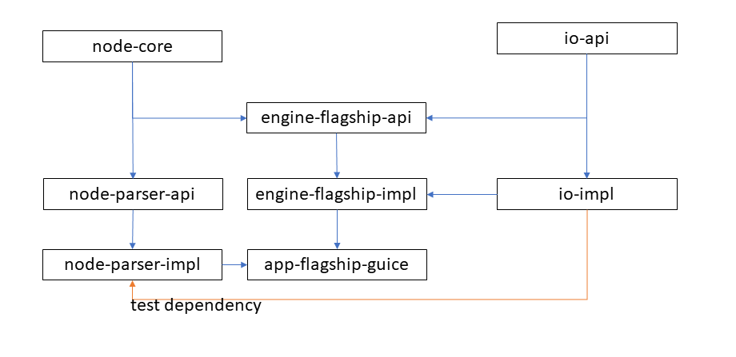

# Developers

This document is intended to support two different types of developers
1. [Customizers](customizer.md) - those who want to extend or replace the API.
2. Maintainersmaintainer.md - those who want to contribute changes to this repository.

This document is intended as a high-level overview of the architecture, organization, and philosophy of the code in the
repository. It is not intended as a deep dive into specific classes or how they work. It is the opinion of the author
(Mark C Taylor aka Jellon) that detailed documentation is best done by automated tests.

## Running The App

See [user documentation](../../engine/flagship/docs/user.md#executing-the-app)

## Philosophy

This is mostly a summary of industry wide best-practices (and some preferences) many of you are already familiar with. Who knows, you might learn something.

TDD (Test Driven Development). This means writing tests before implementing code as much as possible. At the very least, high-level ("feature") tests should be written so that code can be written until the tests pass. Why not BDD? At the time of this writing, there's exactly 1 stakeholder in the entire world. Getting them all in the same room to discuss the project would boarder on insanity!

DRY (Don't Repeat Yourself) code. This means reuse as much as possible. Less code means less to learn and less that can go wrong. Bugs are typically found faster.

Separation of Concerns. It's often better to have very many small classes that handle a very narrow use-case than large classes/methods that do so much the complexity is difficult to follow. Also, classes can be grouped by the type of functionality they provide. Often this makes functionality easier to find.

Never Null. If something could possibly be null, use a scala.lang.Option (or java.util.Optional or io.varv.Option). The only time null checks should need to be done is when integrating with someone else's code that uses null, and it should be mapped to an Option ASAP.

Avoid Exceptions. Throwing exceptions is expensive in any language, especially in a JVM. It has been considered best-practice by Oracle (and Sun Microsystems before Java was bought by Oracle) to avoid throwing exceptions. Use logic checks instead if possible. 

Fail Fast. It's usually easier to find the source of exceptions when they are thrown from the code that causes them, not somewhere else in the code that's not even in the stacktrace.

Detailed Exceptions. When something goes wrong, we want to know as much information that helps us debug it as possible (except user passwords!).

## Technologies

slf4j: Simple Logging Facade for Java. nuff said

spring-boot: dependency injection framework. This is used to support customizers who prefer to use this DI.

guice: dependency injection framework. This is used to support customizers who prefer to use this DI.

jackson: JSON parser.

snake: YAML parser.

antlr: parser compiler generator. This is used to parse anything defined by a grammar from source code files to Natural Language. Outputs tokens which will require custom software to interpret.

string-template4: aka ST4 is a template framework used to generate text files of all kinds. This happens to be provided by the same organization that provides antlr.

apache velocity: or "velocity" for short is a Java specific template framework used to generate text files of all kinds, but it's intended use-case is HTML.

## Architecture

This section is an overview of how things are integrated. If the diagram falls behind, you can always check build.sbt

io-api: contains traits which a customizer is likely to implement for customization.

io-spi: contains traits with a default implementation provided by io-impl which use io-api via dependency injection managed by the customizer.

io-impl: provides default implementation of io-impl.

node-core: contains traits and classes with minimal logic that can represent many common text technologies such as JSON, YAML, or XML.

node-parser-api: contains traits that a customizer might want to implement if none of the default implementations suit their needs.

node-parser-impl: provides default implementation for node-parser-api that allow for parsing JSON, YAML, or XML files into nodes defined in node-core.

engine-flagship-api: contains traits and classes that a customizer might want to implement if the default implementation provided doesn't suit their needs.

engine-flagship-impl: contains implementations of engine-flagship-api that are useful for creating an application driven by an external dependency injection framework.

engine-flagship-app-guice: contains a class with a main method that uses the Guice for dependency injection to run the application on required inputs.

### node-core

This document is to detail how INode is used. This should be useful for anyone interacting with SSG code.
